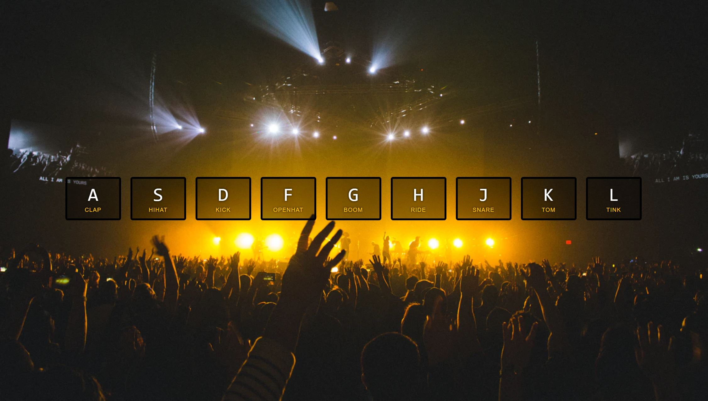
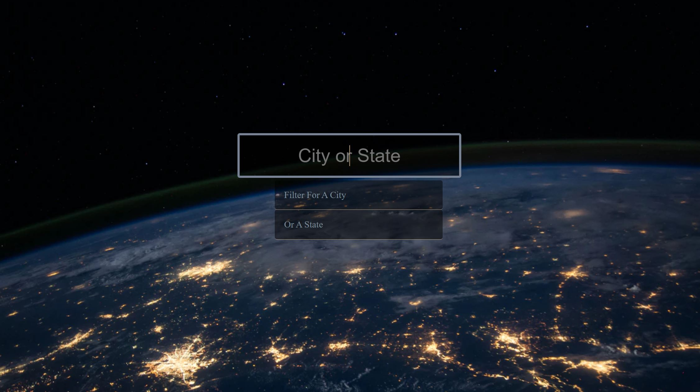
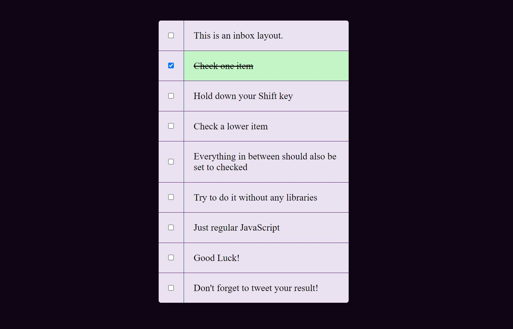
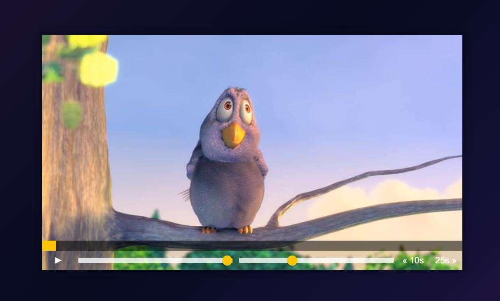

# Javascript 30

## 🥁 Day 1

Compelted on the 23rd Aug 2021 -**Drum Kit Challenge**!

## 🕖Day 2

Completed 25th Aug - **Clock**

## ✨Day 3

Completed 26th Aug - **CSS Variables**

## 📇Day 4

Completed 27th Aug - **Arrays**

## 🖼️Day 5

Completed 29th Aug - **Flex Panel Gallery**

## 🏙️ Day 6

Completed 30th Aug - **Ajax City Search**

## 📇 Day 7

Completed 31th Aug - **Arrays part 2**

## 🏙️ Day 8

Completed 1st Sept - **HTML5 Canvas**

## 🏙️ Day 9

Completed 1st Sept - **Dev Tool Tricks**

## ☑️ Day 10

Completed 2nd Sept - **Checkbox-Hold shift key to check multiple boxes**

## ☑️ Day 11

Completed 3rd Sept - **HTML5 Video**

