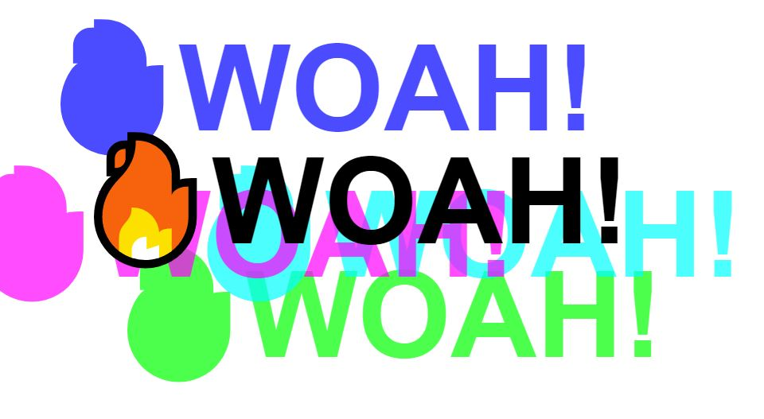
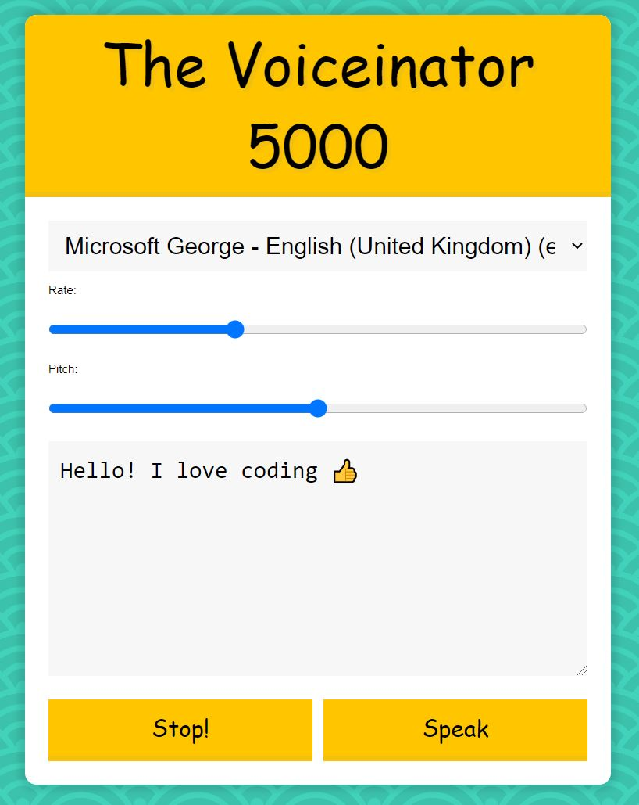
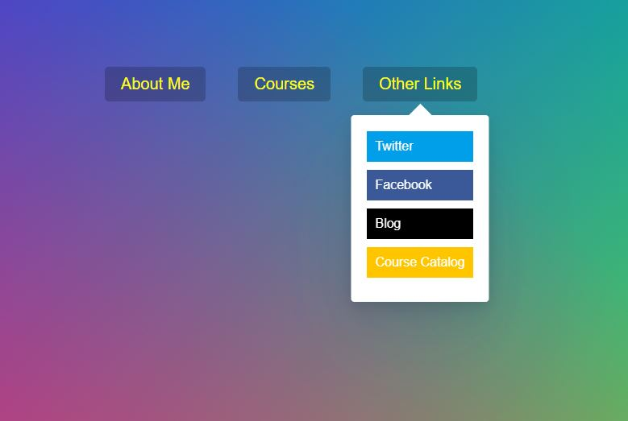
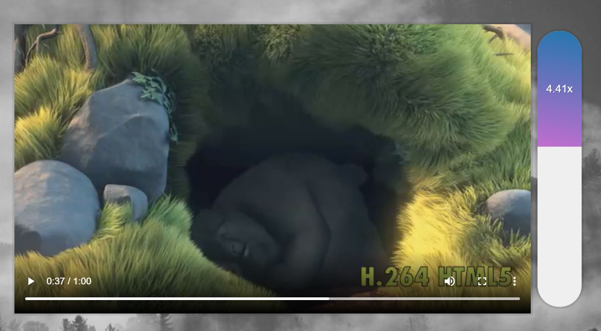

# Javascript 30

## 🥁 Day 1

Compelted on the 23rd Aug 2021 -**Drum Kit Challenge**!

## 🕖Day 2

Completed 25th Aug - **Clock**

## ✨Day 3

Completed 26th Aug - **CSS Variables**

## 📇Day 4

Completed 27th Aug - **Arrays**

## 🖼️Day 5

Completed 29th Aug - **Flex Panel Gallery**

## 🏙️ Day 6

Completed 30th Aug - **Ajax City Search**

## 📇 Day 7

Completed 31th Aug - **Arrays part 2**

## 🏙️ Day 8

Completed 1st Sept - **HTML5 Canvas**

## 🏙️ Day 9

Completed 1st Sept - **Dev Tool Tricks**

## ☑️ Day 10

Completed 2nd Sept - **Checkbox-Hold shift key to check multiple boxes**

## 📹 Day 11

Completed 3rd Sept - **HTML5 Video**

## ⌨️ Day 12

Completed 5th Sept - **Key Detection**

## 📇 Day 13

Completed 5th Sept - **Slide in on scroll**

## ⌨️ Day 14

Completed 6th Sept - **Reference Vs Copy**

## ☑️ Day 15

Completed 7th Sept - **Local Storage**

## ✨ Day 16

Completed 8th Sept - \*_Mouse Move Shadow_

## 🏙️ Day 17

Completed 9th Sept - **Array sort**

## 🖼️ Day 18

Completed 10th Sept - **String Time with Reduce**

## 🏙️ Day 19

Completed 14th Sept - **Webcam Fun**

## 📇 Day 20

Completed 15th Sept - **Speech Recognition**

## ✨ Day 21

Could not be complete as do not have a mac - **Geolocation**

## 📇 Day 22

Completed 16h Sept - **Follow Along Link Highlighter**

## ⌨️ Day 23

Completed 17th Sept - **Speech Synthesis**

## ☑️ Day 24

Completed 18th Sept - **Sticky Nav**

## 🏙️ Day 25

Completed 19th Sept - **Event capture, propagation, bubblins and Once**

## ⌨️ Day 26

Completed 26th Sept - **Dropdown nav**

## ⌨️ Day 27

Completed 27th Sept - **Click and Drag**

## 🖼️Day 28

Completed 28th Sept - **Video Speed Control**

